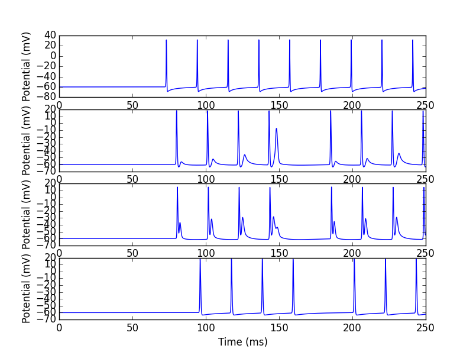
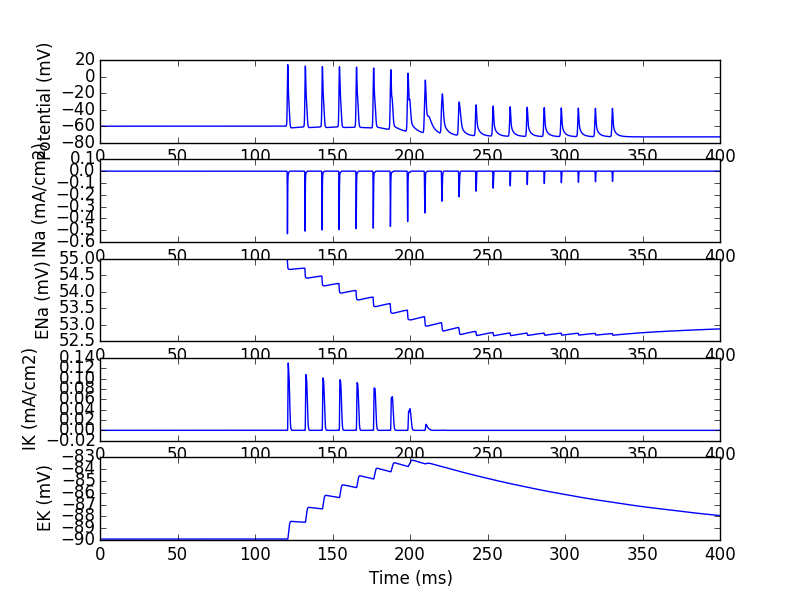

# Spike Propagation through the Dorsal Root Ganglion
Two versions of the model of an un-myelinated, C-fiber sensory neuron from:

> Sundt D, Gamper N, and Jaffe DB. Spike propagation through the dorsal
> root ganglia in an unmyelinated sensory neuron: a modeling study. *J
> Neurophysiol.* 2015 Dec 1;114(6):3140-53. [doi:10.1152/jn.00226.2015](https://doi.org/10.1152/jn.00226.2015)

The two versions, located in separate folders, generate Figures 5d and 8c. Figure5d varies M-channel density and illustrates where the reflecting spike generated. Figure8c illustrates the effect of the Na/K pump on membrane potential and spike failure at the T-junction.

## Running the simulations
Here is a sketch of how to run the programs.  There is more help available at 
[https://modeldb.science/NEURON_DwnldGuide](https://modeldb.science/NEURON_DwnldGuide).

1. Compile the ".mod files" within the mods folder.

2. For each version of the model, compile the mod files within the mod
folder (`Figure5d/mods` & `Figure8c/mods`).

3. For either version (`Figure5d.hoc` or `Figure8c.hoc`), run the
simulation using the "special" executable.

4. Data output, `Fig5doutput.dat` or `Fig8coutput.dat`, can be viewed
using the python scripts provided (`Plot5d.py` and `Plot8c.py`,
respectively). You should see the following graphs:

---

## Changelog

2024-10-01 Updated links and converted readme to markdown
